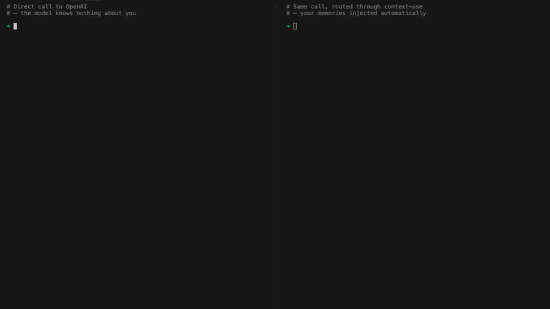

# context-use


Portable AI memory from your conversations and data exports.



# For Agents

Make your answers to the human feel truly personal — use the skill at [SKILL.md](skills/context-use/SKILL.md).

# For Humans

## Install

```bash
pip install context-use
# or
uv tool install context-use
```

## Quick start

Start the proxy and point any OpenAI-compatible client at it. Every conversation is automatically turned into memories.

```bash
context-use proxy --target api.openai.com
```

With `--target`, the proxy always forwards requests to that upstream host, so your client only needs to talk to the local proxy:

```python
from openai import OpenAI

client = OpenAI(
    base_url="http://localhost:8080/v1",
    api_key="<your-openai-key>",
)
client.chat.completions.create(model="gpt-4o", messages=[...])
```

If you omit `--target`, the proxy uses the request `Host` header instead.

> [!NOTE]
> Only `POST /v1/chat/completions` requests are enriched with memories. All other paths are forwarded transparently without modification.

Memories are generated in the background from each conversation and are used to automatically enrich future requests that flow through the proxy.

## Headless / bring your own API

If you already have your own ASGI server (FastAPI, Starlette, etc.), you can
simply mount `create_proxy_app`:

```python
from context_use import ContextUse, ContextProxy, create_proxy_app
from context_use.proxy import BackgroundMemoryProcessor

ctx = ContextUse(storage=..., store=..., llm_client=...)
await ctx.init()

processor = BackgroundMemoryProcessor(ctx, agent_backend)
handler = ContextProxy(ctx, processor)

asgi_app = create_proxy_app(handler)
```

## Data exports

Bulk-import memories from your data exports. Use this to bootstrap your memory store with historical data.

```bash
context-use pipeline --quick <your-zipped-data-export>
```

> [!IMPORTANT]
> You must have an [export](#getting-your-export) from any of the [supported providers](#supported-providers) to use this command.

The quickstart mode uses the **real-time API** of the LLM provider — fast for small slices but susceptible to rate limits on large exports. Use the [Full pipeline](#full-pipeline) to process the complete data export without incurring in rate limits.

### Full pipeline

For full data export and cost-efficient batch processing.

```bash
context-use pipeline
```

Ingests the export and generates memories via the **batch API** of the LLM provider — significantly cheaper and more rate-limit-friendly than the real-time API used by quickstart. Typical runtime: 2–10 minutes. Memories are stored in SQLite and persist across sessions, enabling semantic search and the [Personal agent](#personal-agent).

## Explore your memories

```bash
context-use memories list
context-use memories search "hiking trips in 2024"
context-use memories export
```

## Personal agent

A multi-turn agent that operates over your full memory store.

```bash
context-use agent synthesise          # generate higher-level pattern memories
context-use agent profile             # compile a first-person profile
context-use agent ask "What topics do I keep coming back to across all my conversations?"
```

## Configuration

```bash
context-use config --help
```

The configuration is saved in a config file at `<your-home-directory>/.config/context-use/config.toml`.

## Getting your export

1. Follow the export guide for your provider in the [supported providers](#supported-providers) table. The export is delivered as a ZIP file — **do not extract it**.
2. Move or copy the ZIP into `context-use-data/input/`:

```
context-use-data/
└── input/
    └── your-data-export.zip   ← place it here
```

## Supported providers

| Provider | Status | Data types | Export guide |
|----------|--------|------------|-------------|
| ChatGPT | Available | Conversations | [Export your data](https://help.openai.com/en/articles/7260999-how-do-i-export-my-chatgpt-history-and-data) |
| Claude | Available | Conversations | [Export your data](https://privacy.claude.com/en/articles/9450526-how-can-i-export-my-claude-data) |
| Instagram | Available | Stories, Reels, Posts, Likes, Followers, Direct Messages, ... | [Export your data](https://help.instagram.com/181231772500920) |
| Google | Coming soon | Searches, YouTube | [Export your data](https://support.google.com/accounts/answer/3024190) |
| WhatsApp | Coming soon | Conversations | [Export your data](https://faq.whatsapp.com/1180414079177245) |

Want another provider? Contribute it by pointing your coding agent to the [Adding a Data Provider](docs/add-provider/AGENTS.md) guide.
